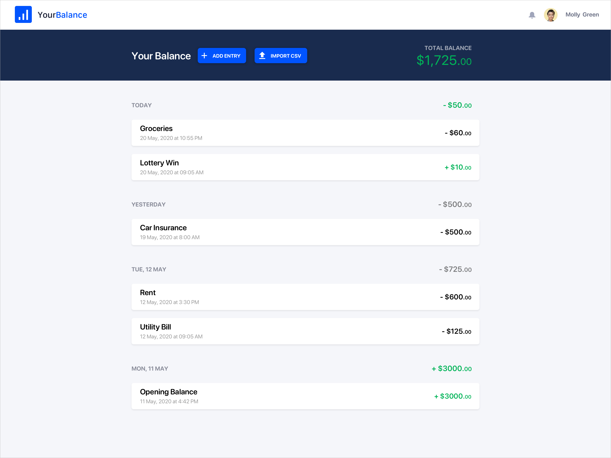
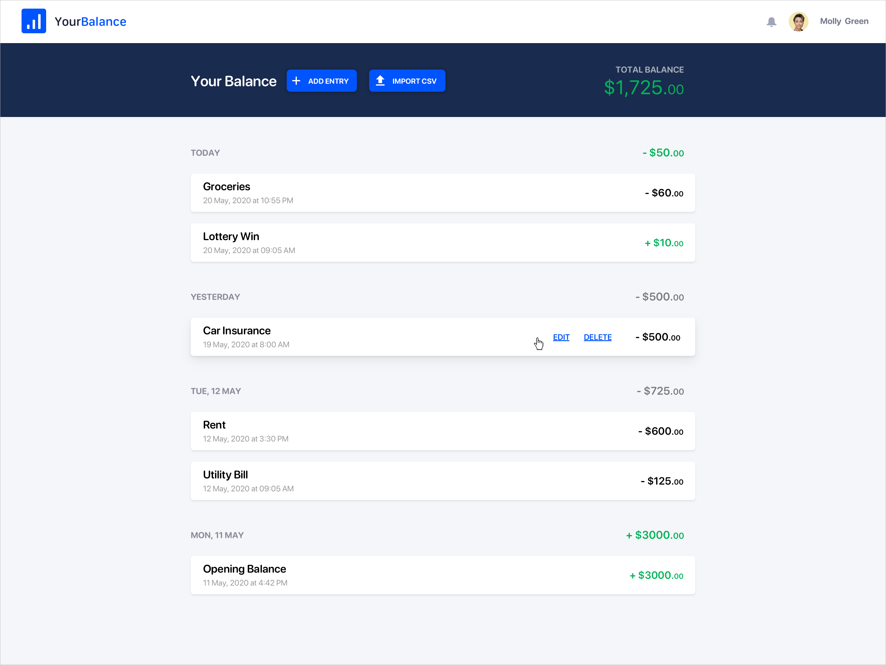

# Demo App with Laravel and Vue

This project demo the implementation of a Backend with Laravel and a Frontend using blade templates and Vue.js

### Screenshots

A list of the user's balance entries should be shown by default. Entries should be grouped by date.

A user should be able to add single balance entries. Adding a new entry should update the balance list and the total balance.

Hovering over an entry should show the edit and delete links.

Clicking 'Delete' should remove the entry from the list and update the total balance. Clicking 'Edit' should reveal the edit form.

Clicking 'Update Entry' should update the balance list and update the total balance.
