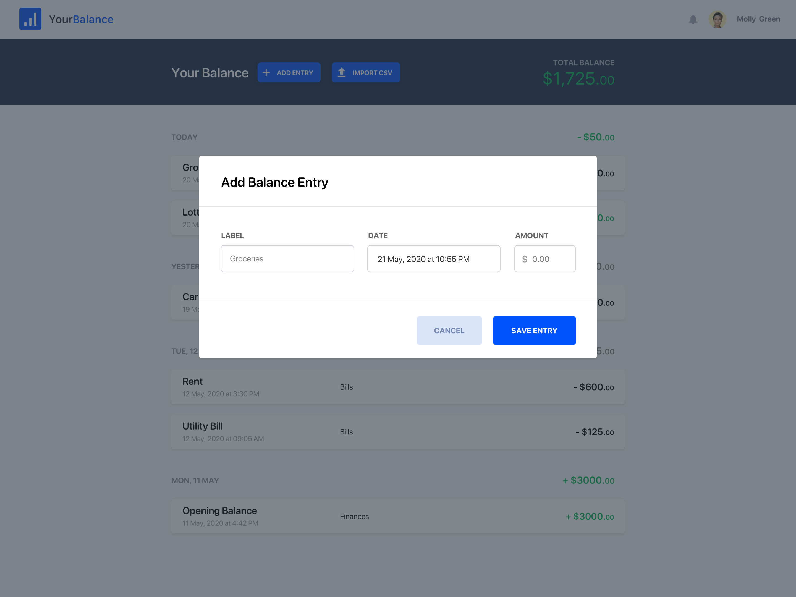

# Finance App Trial Project

This project proposal has been put together to help developers who are applying for new positions but don't have any sample code to provide during the hiring process.

## Requirements

The trial project is split into two phases. This helps to break the project into smaller, more manageable chunks. It also allows us to provide you with project feedback along the way.

The trial project should be built using Laravel and Vue.js and should demonstrate your abilities with these frameworks. We will also be looking at how accurately you can implement high fidelity mockups.

### Phase 1

A list of the user's balance entries should be shown by default. Entries should be grouped by date. Although pagination is missing from the mockups, please add basic pagination for when more than 100 entries exist.

A user should be able to add single balance entries. Adding a new entry should update the balance list and the total balance.

Hovering over an entry should show the edit and delete links.

Clicking 'Delete' should remove the entry from the list and update the total balance. Clicking 'Edit' should reveal the edit form.

Clicking 'Update Entry' should update the balance list and update the total balance.

### Phase 1 Delivery

Once you've completed phase 1, you should deliver it for feedback before continuing on to phase 2.

1. Create an empty GitHub repo for your project (public or private, up to you)
1. If the repo is private, grant @A5hleyRich @gilbitron @bradt access
1. Create a `phase1` branch and make all your commits to that branch
1. When it's ready for review, push the `phase1` branch to GitHub
1. Open a pull request to merge `phase1` into the `master` branch and mention @A5hleyRich in the PR comment
1. Reply to our email to let us know you've mentioned Ash in the PR

### Phase 2

A [CSV file](data/5000-balance-entries.csv) of entries can be imported. The import should happen in the background. The 'Add Entry' and 'Import CSV' buttons should be disabled while the import is working, however, existing entries can be edited or deleted.

Imported entries should not appear in the balance list, until the entire import has completed. When the import is running, a notice should be shown with the count of entries currently being imported.

### Phase 2 Delivery

1. Create a new `phase2` branch off of the `phase1` branch and make all your Phase 2 commits to it
1. When it's ready for review, push the `phase2` branch to GitHub
1. Open a pull request to merge `phase2` into the `phase1` branch and mention @A5hleyRich in the PR comment
1. Reply to our email to let us know you've mentioned Ash in the PR
